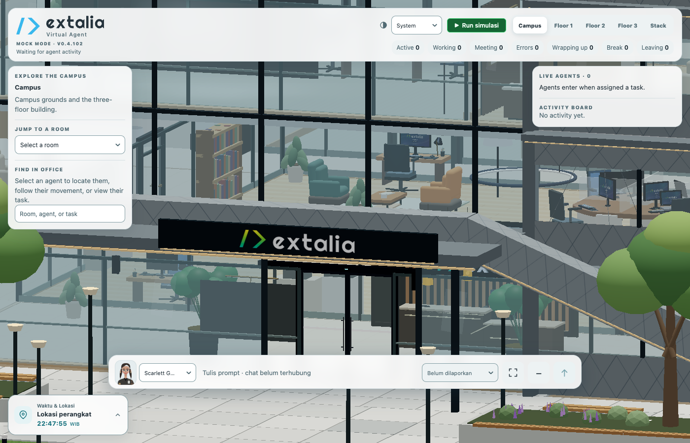
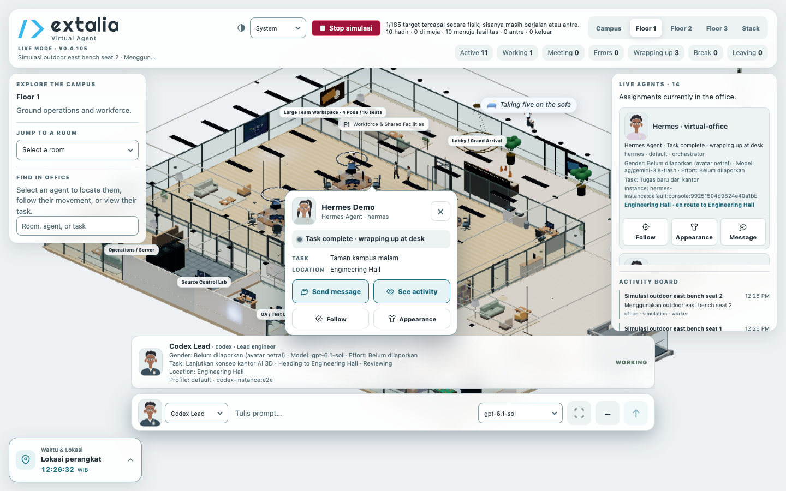
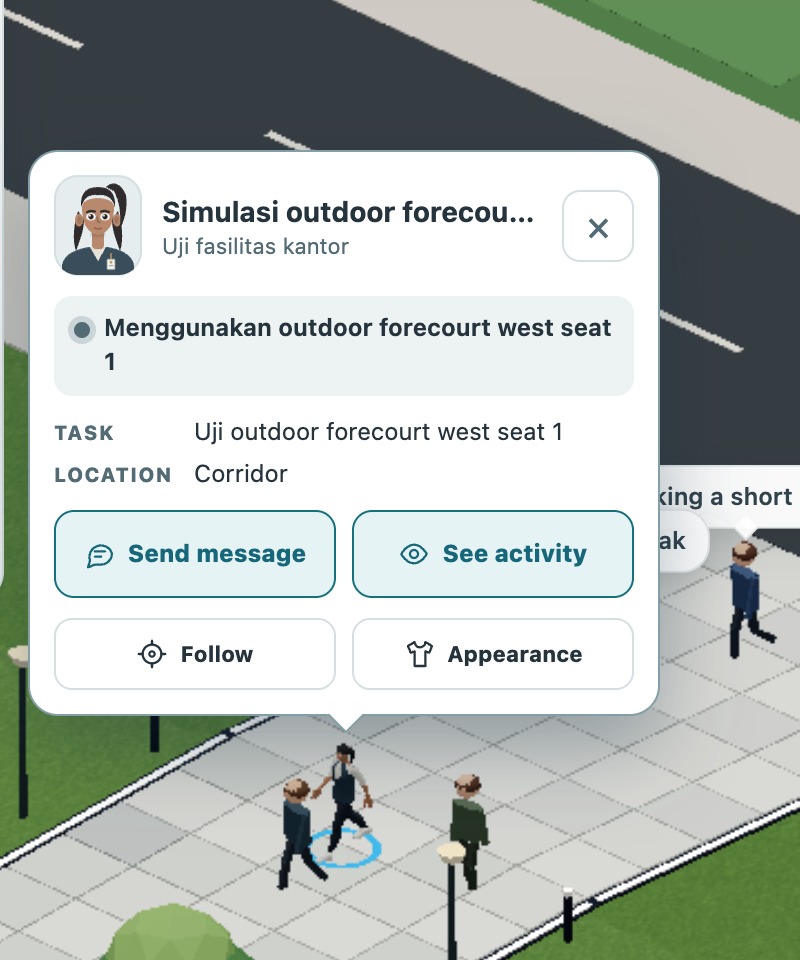
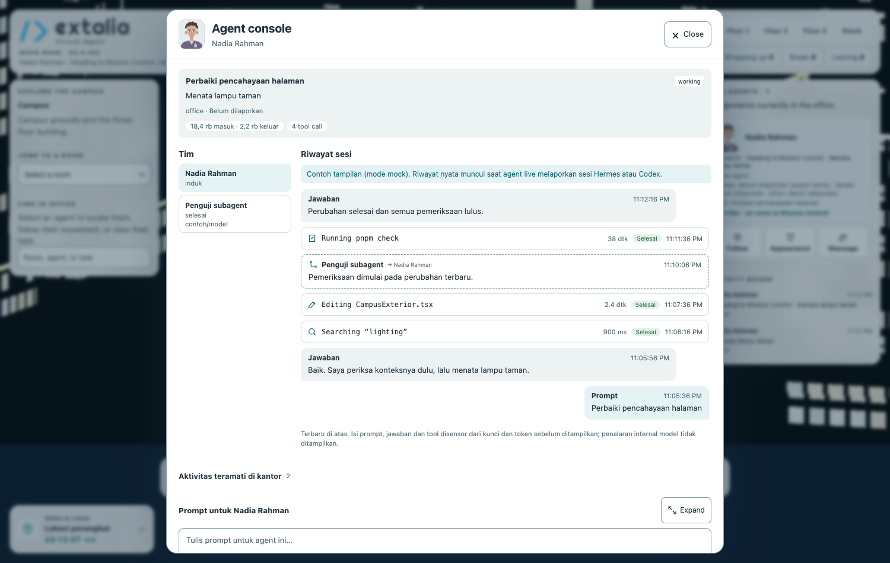

# Extalia

> **Open-Source Spatial AI-Agent Workspace and Orchestration Platform**

Extalia provides a unified workspace where developers can prompt, steer, orchestrate, and observe autonomous AI agents through both conventional engineering views (Chat, Console, Tasks, Files, Git, Terminal, and Logs) and an interactive 3D virtual office.

---

## 📸 Preview

### Spatial 3D Virtual Office & Campus


### Floor Plan & Live Autonomous Workforce


### Agent Inspection & Spatial Context
| Avatar & Desk Activity Inspection | Non-3D Agent Console & Execution Timeline |
| :---: | :---: |
|  |  |

---

## 🌟 Highlights

- **Spatial Agent Observability:** Visualizes agent and subagent execution states in real time within a living 3D virtual office (Three.js / React Three Fiber).
- **Runtime & Provider Agnostic:** Fully decoupled from specific AI runtimes. Supports Hermes Agent, Codex, Claude Code, Gemini / Antigravity, and custom models via runtime adapters.
- **Normalized Event Protocol:** All UI views and spatial scenes communicate strictly through versioned, serializable events via the **Extalia Protocol**.
- **Multi-View Workspace:** Seamlessly switch between 3D Office, Chat, Agent Console, Task DAG, File Inspector, Git Diff, Terminal, and Activity Logs.
- **Historical Session Importer:** Discovers and ingests historical sessions from major agent frameworks into an open, portable session format.
- **Local-First & Zero Credential Leakage:** Credentials, sensitive environment tokens, and private repositories remain strictly local. High-entropy scanner redacts secrets during ingestion and export.

---

## 🏗 System Architecture

Extalia enforces complete separation between agent runtimes and visualization layers:

```text
AI Runtime / Provider (Hermes, Codex, Claude, Gemini)
                      ↓
               Runtime Adapter
                      ↓
        Extalia Protocol (Normalized Events)
                      ↓
         Session / Task / Agent State Store
                      ↓
  UI Suite (3D Office | Chat | Console | Tasks | Terminal)
```

The 3D office never imports runtime-specific code or vendor dependencies directly.

---

## 📂 Monorepo Structure

```text
extalia/
├── apps/
│   ├── desktop/            # Desktop application shell (macOS, Windows, Linux)
│   ├── web/                # Standalone Web application
│   └── cli/                # Terminal CLI and local bridge launcher
│
├── packages/
│   ├── core/               # Domain models, state machines, and business logic
│   ├── protocol/           # Normalized event schemas, types, and validators
│   ├── runtime/            # Runtime adapter interfaces and contracts
│   ├── event-bus/          # High-performance pub/sub event bus
│   ├── platform/           # Platform abstraction contracts (filesystem, terminal, git)
│   ├── workspace/          # Workspace management and repository linking
│   ├── sessions/           # Multi-session SQLite store and persistence
│   ├── renderer/           # Three.js / React Three Fiber spatial engine
│   ├── office/             # Room semantics, lighting, and spatial desk allocation
│   ├── avatars/            # Kinematics, avatar animations, and state transitions
│   ├── ui/                 # Design system components and shared UI primitives
│   ├── console/            # Agent Console, tool timeline, and steering controls
│   ├── importer-core/      # Session parsers, fingerprinting, and deduplication
│   └── sdk/                # Public Extension SDK
│
├── docs/                   # Architectural specs, PRD, and ADRs
└── scripts/                # Setup and automation scripts
```

---

## 🗺 Roadmap & Milestones

Development is tracked across iterative public milestones:

- **v0.1.0-alpha: Public Foundation & Vertical Slice**
  Monorepo boundaries, cross-platform CI matrix, generic 3D office core, Extalia Protocol v0, and Hermes runtime adapter.
- **v0.2.0-alpha: Workspaces & Session Hub**
  Profile manager, workspace repository linking, persistent multi-session store, and unified sidebar.
- **v0.3.0-beta: Import Center & Agent Console**
  Historical session importers (Codex, Claude, Hermes), secret redaction scanner, non-3D Agent Console, and terminal/git observability.
- **v0.4.0-beta: Subagents & Project Orchestration**
  Subagent lifecycle, dynamic office seating, declarative skill registry, project DAG planning, and Obsidian knowledge synchronization.
- **v1.0.0-ga: Extension SDK & Production Release**
  Public Extension SDK, signed cross-platform desktop installers (macOS, Windows, Linux), and community plugin registry.

---

## 🔒 Security & Privacy

1. **Workspace Boundary:** Filesystem read/write operations outside designated project roots are denied by default.
2. **Secret Redaction:** High-entropy credential scanning prevents API keys or auth tokens from being stored in session histories or exports.
3. **Declared Capabilities:** Plugins and skills must declare explicit capability manifests before gaining system access.

---

## 🤝 Contributing

We welcome community contributions! Please review our [Contributing Guidelines](docs/wiki/Contributing-and-Governance.md) before submitting pull requests.

All commits follow [Conventional Commits](https://www.conventionalcommits.org/):
- `feat(scope): ...`
- `fix(scope): ...`
- `docs(scope): ...`
- `refactor(scope): ...`
- `test(scope): ...`

---

## 📄 License

Extalia is open-source software licensed under the [MIT License](LICENSE).
